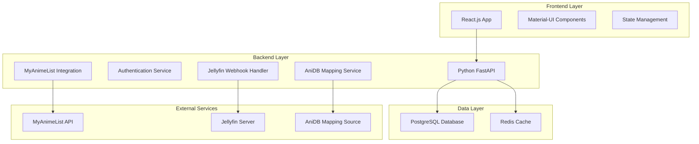

# Design Document

## Overview

The Anime Management System is a full-stack web application that provides a comprehensive anime tracking solution by integrating MyAnimeList API with Jellyfin media server. The system follows a modern three-tier architecture with a React.js frontend, Python backend API, and PostgreSQL database. The application emphasizes real-time synchronization between local data and MyAnimeList, automatic progress tracking through Jellyfin integration, and a responsive user interface built with Material-UI components.

## Architecture

### High-Level Architecture



### Technology Stack

**Frontend:**
- React.js 18+ with functional components and hooks
- Material-UI (MUI) v5 for UI components
- React Router for navigation
- Axios for HTTP requests
- Chart.js for score distribution graphs
- React Query for data fetching and caching

**Backend:**
- Python 3.11+ with FastAPI framework
- SQLAlchemy ORM for database operations
- Alembic for database migrations
- Pydantic for data validation
- Celery for background tasks
- Redis for caching and task queue

**Database:**
- PostgreSQL 15+ for primary data storage
- Redis for session storage and caching

## Components and Interfaces

### Frontend Components

#### Core Layout Components
- `AppLayout`: Main application wrapper with navigation
- `Sidebar`: Navigation menu with route links
- `Header`: Top bar with user info and logout
- `LoadingSpinner`: Reusable loading indicator
- `ErrorBoundary`: Error handling wrapper

#### Authentication Components
- `LoginForm`: User login interface
- `RegisterForm`: User registration interface
- `TokenSetup`: MyAnimeList OAuth integration

#### Dashboard Components
- `Dashboard`: Main statistics overview page
- `StatCard`: Reusable statistic display card
- `ScoreDistributionChart`: Bar graph for score distribution
- `RecentActivity`: Recent anime updates feed

#### Anime List Components
- `AnimeListPage`: Generic list page template
- `AnimeCard`: Individual anime display card
- `AnimeModal`: Detailed anime information popup
- `StatusSelector`: Dropdown for anime status changes
- `ProgressUpdater`: Episode progress input component

#### Search Components
- `SearchPage`: Anime search interface
- `SearchBar`: Search input with autocomplete
- `SearchResults`: Grid display of search results
- `AddToListModal`: Interface for adding anime to lists

#### Mapping Components
- `MappingPage`: AniDB to MyAnimeList mapping interface
- `MappingTable`: Table display of current mappings
- `MappingEditor`: Interface for editing mappings

### Backend API Endpoints

#### Authentication Endpoints
```
POST /api/auth/register
POST /api/auth/login
POST /api/auth/logout
POST /api/auth/refresh
GET /api/auth/me
```

#### MyAnimeList Integration Endpoints
```
GET /api/mal/auth-url
POST /api/mal/callback
GET /api/mal/user-info
POST /api/mal/refresh-token
```

#### Anime Management Endpoints
```
GET /api/anime/lists/{status}
PUT /api/anime/{anime_id}/status
PUT /api/anime/{anime_id}/progress
DELETE /api/anime/{anime_id}
GET /api/anime/search?q={query}
POST /api/anime/add
```

#### Dashboard Endpoints
```
GET /api/dashboard/stats
GET /api/dashboard/score-distribution
GET /api/dashboard/recent-activity
```

#### Jellyfin Integration Endpoints
```
POST /api/jellyfin/webhook
GET /api/jellyfin/mappings
PUT /api/jellyfin/mappings/{anidb_id}
```

### External API Integration

#### MyAnimeList API Integration
- OAuth 2.0 authentication flow
- User anime list retrieval and updates
- Anime search functionality
- Rate limiting compliance (1 request per second)
- Automatic token refresh handling

#### Jellyfin Webhook Integration
- Webhook endpoint for playback events
- AniDB ID extraction from media metadata
- Progress calculation based on episode completion

## Data Models

### User Model
```sql
CREATE TABLE users (
    id SERIAL PRIMARY KEY,
    username VARCHAR(50) UNIQUE NOT NULL,
    name VARCHAR(100) NOT NULL,
    password_hash VARCHAR(255) NOT NULL,
    mal_access_token TEXT,
    mal_refresh_token TEXT,
    mal_token_expires_at TIMESTAMP,
    created_at TIMESTAMP DEFAULT CURRENT_TIMESTAMP,
    updated_at TIMESTAMP DEFAULT CURRENT_TIMESTAMP
);
```

### Anime Model
```sql
CREATE TABLE anime (
    id SERIAL PRIMARY KEY,
    mal_id INTEGER UNIQUE NOT NULL,
    title VARCHAR(255) NOT NULL,
    title_english VARCHAR(255),
    synopsis TEXT,
    episodes INTEGER,
    status VARCHAR(50),
    aired_from DATE,
    aired_to DATE,
    score DECIMAL(3,2),
    rank INTEGER,
    popularity INTEGER,
    image_url TEXT,
    created_at TIMESTAMP DEFAULT CURRENT_TIMESTAMP,
    updated_at TIMESTAMP DEFAULT CURRENT_TIMESTAMP
);
```

### User Anime List Model
```sql
CREATE TABLE user_anime_lists (
    id SERIAL PRIMARY KEY,
    user_id INTEGER REFERENCES users(id) ON DELETE CASCADE,
    anime_id INTEGER REFERENCES anime(id) ON DELETE CASCADE,
    status VARCHAR(20) NOT NULL, -- watching, completed, on_hold, dropped, plan_to_watch
    score INTEGER CHECK (score >= 0 AND score <= 10),
    episodes_watched INTEGER DEFAULT 0,
    start_date DATE,
    finish_date DATE,
    notes TEXT,
    created_at TIMESTAMP DEFAULT CURRENT_TIMESTAMP,
    updated_at TIMESTAMP DEFAULT CURRENT_TIMESTAMP,
    UNIQUE(user_id, anime_id)
);
```

### AniDB Mapping Model
```sql
CREATE TABLE anidb_mappings (
    id SERIAL PRIMARY KEY,
    anidb_id INTEGER UNIQUE NOT NULL,
    mal_id INTEGER REFERENCES anime(mal_id),
    title VARCHAR(255),
    confidence_score DECIMAL(3,2),
    source VARCHAR(50), -- 'manual', 'auto', 'github_file'
    created_at TIMESTAMP DEFAULT CURRENT_TIMESTAMP,
    updated_at TIMESTAMP DEFAULT CURRENT_TIMESTAMP
);
```

### Jellyfin Activity Model
```sql
CREATE TABLE jellyfin_activities (
    id SERIAL PRIMARY KEY,
    user_id INTEGER REFERENCES users(id) ON DELETE CASCADE,
    anidb_id INTEGER,
    mal_id INTEGER,
    episode_number INTEGER,
    watch_duration INTEGER, -- in seconds
    total_duration INTEGER, -- in seconds
    completion_percentage DECIMAL(5,2),
    jellyfin_item_id VARCHAR(255),
    processed BOOLEAN DEFAULT FALSE,
    created_at TIMESTAMP DEFAULT CURRENT_TIMESTAMP
);
```

## Error Handling

### Frontend Error Handling
- Global error boundary for React component errors
- HTTP error interceptors with user-friendly messages
- Form validation with real-time feedback
- Retry mechanisms for failed API calls
- Offline state detection and handling

### Backend Error Handling
- Custom exception classes for different error types
- HTTP status code standardization
- Detailed error logging with request context
- Rate limiting error responses
- Database transaction rollback on failures

### MyAnimeList API Error Handling
- Token expiration detection and automatic refresh
- Rate limit compliance with request queuing
- API downtime detection with fallback to cached data
- Partial failure handling for batch operations

## Testing Strategy

### Frontend Testing
- Unit tests for utility functions and hooks using Jest
- Component testing with React Testing Library
- Integration tests for user workflows
- Visual regression testing for UI components
- End-to-end testing with Cypress for critical paths

### Backend Testing
- Unit tests for service functions using pytest
- API endpoint testing with FastAPI TestClient
- Database integration tests with test database
- Mock testing for external API integrations
- Load testing for high-traffic endpoints

### Integration Testing
- Full-stack integration tests for complete user workflows
- MyAnimeList API integration testing with sandbox environment
- Jellyfin webhook testing with mock payloads
- Database migration testing across versions

### Performance Testing
- Frontend bundle size optimization
- API response time benchmarking
- Database query performance analysis
- Concurrent user load testing
- Memory usage profiling for long-running processes

## Security Considerations

### Authentication & Authorization
- JWT tokens for session management
- Password hashing with bcrypt
- OAuth 2.0 integration with MyAnimeList
- Role-based access control for admin features
- Session timeout and refresh token rotation

### Data Protection
- Input validation and sanitization
- SQL injection prevention through ORM
- XSS protection with Content Security Policy
- HTTPS enforcement for all communications
- Sensitive data encryption at rest

### API Security
- Rate limiting to prevent abuse
- CORS configuration for frontend access
- API key validation for Jellyfin webhooks
- Request size limits to prevent DoS
- Audit logging for sensitive operations

## Deployment Architecture

### Development Environment
- Docker Compose for local development
- Hot reloading for both frontend and backend
- Local PostgreSQL and Redis instances
- Environment variable configuration

### Production Environment
- Containerized deployment with Docker
- Reverse proxy with Nginx
- SSL termination and certificate management
- Database connection pooling
- Redis clustering for high availability
- Monitoring with Prometheus and Grafana
- Log aggregation with ELK stack